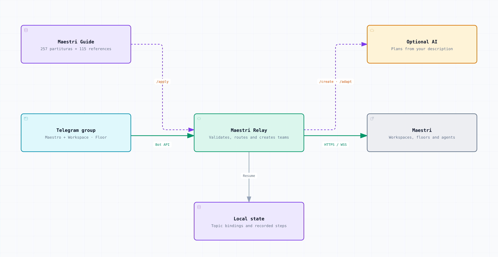

# Maestri Relay

Control agents and build teams in Maestri from Telegram. One group, `Workspace · Floor` topics, and a `Maestro` topic for creating or adapting teams from a description.

A fork of [herdr-telegram-agents](https://github.com/permgps/herdr-telegram-agents), integrated through the official Maestri Wire API. Experimental: local tests pass, but integration with a real Maestri host and Telegram group still needs validation.



[Interactive Archify diagram](docs/diagrams/maestri-relay.html) · [Diagram source](docs/diagrams/maestri-relay.architecture.json). On GitHub, download the HTML and open it in your browser for zoom, search, themes and export.

## Features

| Feature | How to use it |
| --- | --- |
| One topic per workspace and floor | The bot discovers authorized workspaces and creates their topics. |
| Talk to the right agent | Use `/agents`, then reply to a card; otherwise, messages go to the sole active coordinator. |
| Status, terminal controls and attachments | `/status`, `/screen`, `/focus`, `/stop`, `/interrupt`, and files up to 8 MiB. |
| Complete catalog from the pinned guide | `/partituras description` searches 257 partituras and 115 references. |
| Apply templates | `/apply ID` creates a team on the topic's floor. |
| Create and adapt with AI | `/create description` or `/adapt ID description`; requires an OpenAI-compatible provider. |
| Preview and resume | `/preview description` produces a plan; `/resume ID` resumes recorded steps. |
| Access control | Explicit group, operator and workspace permissions; TLS and Wire pairing. |

## Getting started

From the repository directory, with Go 1.25 and Make installed:

```sh
make build
bin/maestri-tg init
```

Edit `~/.config/maestri-relay/config.json` with the Wire address/public key, group ID, operators and allowed workspaces. Set `TELEGRAM_BOT_TOKEN` in the local environment. Enable pairing in Maestri and run:

```sh
bin/maestri-tg pair
bin/maestri-tg doctor
bin/maestri-tg catalog-sync
bin/maestri-tg run
```

The bot must be an administrator of a supergroup with topics enabled. Use a floor topic to chat or apply templates. In `Maestro`, try: “Create a Review floor in the Demo Project workspace with one coordinator and two Codex reviewers.” For this, configure `llmURL`, `llmModel` and the provider key in the environment.

**Each installation uses its own credentials.** No shared tokens are distributed. Pairing is stored outside the repository; `.env` files, local state and tokens are covered by `.gitignore`. See the [full setup guide](docs/maestri-relay-setup.md) and [publication audit](docs/publication-audit.md).

## Current limitations

The pinned catalog includes **257 partituras and 115 reference examples**. Partituras are Maestri's saved canvas arrangements. Those containing portals require an initial import into Maestri's library: Wire can list/apply them, but cannot import the library or create portals. References become notes; recipes and scripts from the guide are not executed. Adaptations that change portals may require another import.

`/screen` shows a preview, without full terminal history. Parity with Herdr's Git and presence controls is still pending. Bot and CLI messages currently use Brazilian Portuguese; natural-language requests can be written in English. `make build` also preserves `bin/herdr-tg`; upstream installers and releases target the original Herdr integration.

- [Setup, commands and current limitations](docs/maestri-relay-setup.md)
- [Approved plan and acceptance criteria](docs/maestri-relay-plan.md)

Diagram made with [Archify](https://github.com/tt-a1i/archify). Code is [MIT licensed](LICENSE), with upstream history and attribution preserved. Users download the Maestri Guide content themselves; it is not redistributed in this repository.

<details>
<summary>Original Herdr documentation</summary>

## Telegram Agents for Herdr: original documentation

The instructions, installers and features below belong to the original Herdr executable. For Maestri Relay, follow the setup guide above.

> One Telegram forum topic per live Herdr agent: status in the topic icon, messages both ways.

A [Herdr](https://herdr.dev) plugin that mirrors the Herdr **Agents** panel into a
Telegram forum supergroup, so you can watch and drive your coding agents
(Claude Code, Codex, Gemini, ...) from a phone. Every agent gets its own topic,
the topic icon follows the agent's status, its questions land in the topic with
a notification, and what you write there goes back to the agent. One command
installs it; no Go, no Node, nothing else on your machine.


*The Herdr agents panel: three agents, one working, one idle, one waiting.*


*The same agents in Telegram: one topic each, the icon is the status, and the
open topic shows a Claude Code question you can answer from the phone.*

## What you get

- **A topic per agent**, named like the Agents panel row (`V3Jobs · claude`),
  created when the agent appears and reused after a restart.
- **Status at a glance**: the topic icon is ⚡ working, ✅ idle, ❓ blocked,
  🏆 done, 👀 unknown, 🏁 exited.
- **Questions come to you**: when an agent gets blocked on a question or an
  approval, the screen is posted into its topic and, for a numbered dialog,
  with one button per option; the bot also sends you the question in its
  private chat with a sound and a link, so you can mute the group and still
  hear the one thing that matters. When the agent finishes, the tail is
  posted silently.
- **Conversation streams live**: new terminal output, including prompts typed
  in Herdr and agent replies, is posted to the agent's topic as it appears.
- **Answers go back**: plain text becomes a prompt, `y` / `n` / `1`..`9` /
  `enter` / `esc` answer dialogs, `/keys` sends raw keys.
- **Look at the screen** with `/screen`, or `/screen all` for everything the
  agent printed since your last message.
- **Claude Code commands** `/clear`, `/compact`, `/usage`, `/model` are typed
  into the agent and the result is posted back.
- **Rename or close** a topic in Telegram to rename or mute the agent in Herdr.
- **A control panel** in the General topic: a pinned dashboard with every
  agent, its status and how long it has been in it, edited in place;
  `/status` with the same lines, `/options`, `/away`, `/here`, `/help`,
  daemon notices.
- **Quiet while you are at the machine** (opt-in): topic edits wait and
  screen posts go silent while your keyboard or mouse is active; when you
  leave, everything catches up and a question still waiting rings once.
  Off by default, one tick in `/options`; macOS and Windows, Linux has no
  idle source yet.
- **Settings from the phone**: `/options` opens a panel with buttons to pause
  the mirror, tune quiet mode, pick the status icons, mask secrets in posts
  and delete the topics of exited agents after a while.
- **A daemon that looks after itself**: starts with Herdr, exits when Herdr
  is gone, heals topic drift on start and on `resync`.

Version `0.10.0`. macOS and Linux are verified end to end; Windows is built and
unit-tested on every change but has not been run against a real Herdr yet.

## Requirements

- Herdr `0.7.5` or newer
- A Telegram bot token from [@BotFather](https://t.me/BotFather)
- A Telegram supergroup with **Topics** enabled, where you can promote the bot
- `sh` and `curl` (macOS, Linux) or PowerShell 5.1+ (Windows) for the install step

## Install

```bash
herdr plugin install permgps/herdr-telegram-agents
```

Herdr clones the repository and runs the plugin's build step, which downloads
the release binary for your OS and architecture into `bin/`, verifies its
SHA-256 against the release checksums and makes it executable. Supported
targets: `darwin/amd64`, `darwin/arm64`, `linux/amd64`, `linux/arm64`,
`windows/amd64`. The plugin is listed on the
[Herdr marketplace](https://herdr.dev/plugins/); the command above is the one
the card shows.

Then run the setup below. Herdr shows the **Telegram Agents** actions listed
further down and runs `bin/herdr-tg startup` after every session restore.

If you download a binary with a browser instead, macOS marks it quarantined;
`xattr -d com.apple.quarantine bin/herdr-tg` clears that. Binaries fetched by
the install script carry no quarantine attribute.

## Setup

1. Create a bot with @BotFather and copy its token.
2. Create a supergroup and enable **Topics** in its settings (this makes it a
   forum). You must be its owner or an administrator who can add admins.
3. In Herdr run the action **Telegram Agents: setup** (from a Herdr pane:
   `herdr plugin action invoke permgps.telegram-agents.setup`). A popup asks
   for the token (typed visibly; the popup closes when setup ends) and prints
   a `https://t.me/<bot>?start=setup` link.
4. Open the link, press **Start** and tap **Choose group**. Telegram lists your
   forum groups and adds the bot to the one you pick as an administrator with
   **Manage topics**, **Delete messages** and **Pin messages**. The person
   who picks the group becomes the operator. Adding the bot to a forum group
   by hand with those rights works as well. Pressing **Start** also opens the
   private chat the bot uses to ring you about questions.
6. Mute the group in Telegram (group name → **Mute** → **Forever**). Every
   status change is a topic edit that would ring; muted, the icons and the
   dashboard stay current in silence and a question still rings from the
   bot's private chat. See [Silence the group](docs/behaviour.md#silence-the-group).
5. Back in the popup confirm the group. The wizard saves `config.json` and
   starts the daemon. From now on the daemon starts automatically with Herdr
   while a configuration exists.

Run the setup action again to reconfigure; it asks before overwriting. The
token, the mapping, the options and the logs live in Herdr's plugin config
and state directories; the files are listed under
[Files, logs and state](docs/behaviour.md#files-logs-and-state).

## Talking to agents

A blocked agent posts its screen with a notification, a finished one posts
its tail silently. Anything you write in the agent's topic goes back:

| You write | The agent gets |
|-----------|----------------|
| plain text | typed as a prompt and submitted |
| `y`, `n`, `1`..`9`, `enter`, `esc` while the agent is blocked | the matching key; a button under the question does the same |
| `/keys esc enter` | raw key names |
| `/screen`, `/screen 40`, `/screen all` | the visible screen, its last 40 lines, or everything since your last message |
| `/focus` | the pane is brought to the front in Herdr |
| `/git status`, `/git diff`, `/git diff staged`, `/git log 5` | git run in the agent's directory; long output arrives as a `.patch` or `.txt` file |
| a photo, file, voice note, audio or video | saved under the plugin's state dir and the agent gets the caption plus the absolute path; an album becomes one prompt |
| `/stop`, `/interrupt` | `esc` (cancel the turn or dialog) or `ctrl+c` (hard interrupt), in any status |
| `/close` | a `Yes, close` / `No` question; `Yes` closes the pane and the topic gets 🏁 |
| `/clear`, `/compact`, `/usage`, `/model` | typed into an idle agent as a Claude Code command; the result is posted back |
| `/status`, `/help` | this agent's status line, the command list |

Prompts are delivered silently; tick `React to prompts` in the settings and
a prompt gets 👀 once the agent took it and 👌 when that turn ends. A
question with `Type something.` carries a ✏️
button: press it and your next message is typed as the answer. A multi-select
question keeps its buttons as toggles, redraws the post with the ticks and
adds `✔ Submit`.

The **General** topic is the control panel: a pinned dashboard lists every
agent with its status and how long it has been in it, `/status` prints the
same lines with a link to each topic, `/new <workspace> [kind]` starts an agent in a new tab
of that workspace, `/options` opens the settings panel, `/away [2h]` and
`/here` override the presence check, `/observers [add|remove <id>]` manages
who may watch, `/help` lists the commands, and the daemon posts its notices
there. Only the configured group is accepted; in it, the operators from
setup drive the agents, observers added with `/observers` may read the group
and use `/status` and `/help` in General, and anyone else is ignored and
logged with their id (see
[Operators and observers](docs/behaviour.md#operators-and-observers)).

Timings, buttons, how the Claude Code commands are forwarded, how `/screen
all` collects its history and what `/status` shows in General are in
[docs/commands.md](docs/commands.md).

## Too many notifications?

A group with sound on rings for every topic edit, every screen post and every
daemon notice, and a few agents produce dozens of those an hour. Mute the
group in Telegram (group name → **Mute** → **Forever**) and keep it muted:
the topic icons, the pinned dashboard, the done posts and `/screen` replies
all keep arriving, silently, ready when you open the app. Nothing important
gets lost, because the one thing that needs you, a question from an agent,
is relayed by the bot: it posts the question into the topic and sends it to
you in your private chat with the bot, with a sound and a link that opens the
topic at that post. Answer there as always. That relay is `Questions in the
bot's chat` in the settings, on by default; the details and the one-time
**Start** it needs are under
[Silence the group](docs/behaviour.md#silence-the-group).

## Settings

`/options` in General opens a panel of buttons, one message edited in place.
Its groups:

| Group | What it holds |
|-------|---------------|
| Sync | `Herdr → Telegram sync`: untick to pause topic edits and screen posts; what you send keeps working. `Dashboard in General`: the pinned status message, edited in place |
| Quiet | quiet mode while you are at the desk: `Away after` (3 min), `Hold topic edits`, `Screen posts` (Silent, Held, Normal), `Re-announce on leaving` |
| Posts | `Done post`: what a finished agent posts, the screen tail (default), its last reply from the Claude Code transcript, or that reply rendered with bold, lists, links and code; `Turn summary line` (on): `⏱ 4 min · fable-5-1 · ✏️ 3 files · ↑ 12k tokens` under every done post, from the Claude Code transcript; `Fold long replies after` (20 lines): a long reply arrives collapsed behind an arrow, the summary line stays visible; `React to prompts` (off): 👀 / 👌 on your message once the agent took it and when the turn ends; `Questions in the bot's chat` (on): a question is posted silently into the topic and rings from the bot's private chat with a link; `Question delay`: wait up to 120 s for a second capture and stay silent when the question was answered in Herdr meanwhile; `Skip short done posts`: no done post for a turn shorter than N seconds; `Trim the input frame` (on): Claude Code's input box, status line and mode hint are cut from the bottom of every screen post |
| Inbox | `Accept files` (on): files sent to a topic are saved and handed to the agent as a path; `Largest file` (20 MB, Telegram's cap for bots); `Delete files after` (7 days) |
| Appearance | one topic icon per status, from Telegram's topic-icon pack |
| Privacy | `Redact secrets`: API keys, tokens, passwords and private keys are masked in every post |
| Topics | `Delete closed topics after`: the topics of exited agents go after 30 days by default; `Keep icon notices for` (20 s): how long the "changed the topic icon" notices stay before the daemon deletes them, `Keep` leaves them |

The choices are saved in `options.json` and survive restarts. Every option,
its default and what it does: [Options](docs/behaviour.md#options); how
presence is measured and what happens when you leave:
[Quiet while at the desk](docs/behaviour.md#quiet-while-at-the-desk); which
secrets are masked: [Secrets in posts](docs/behaviour.md#secrets-in-posts);
when topics are deleted: [Topic cleanup](docs/behaviour.md#topic-cleanup);
where files land and when they go: [Inbox](docs/behaviour.md#inbox).

## Actions

| Action | What it does |
|--------|--------------|
| `Telegram Agents: setup` | Opens the setup popup |
| `Telegram Agents: start` | Starts the daemon if it is not running |
| `Telegram Agents: stop` | Asks the daemon to exit (SIGTERM as the Unix fallback, then SIGKILL after 10 s) |
| `Telegram Agents: restart` | Stop followed by start |
| `Telegram Agents: status` | Whether the daemon runs, its pid and uptime, and the daemon's own line: version, live agents, dropped jobs, Herdr socket health, sync, topic cleanup, quiet state and whether the pager reaches your private chat |
| `Telegram Agents: resync` | Asks the running daemon to re-check every topic against the live agents |
| `Telegram Agents: logs` | Opens an overlay with the last 100 log lines and follows the file |
| `Telegram Agents: doctor` | Opens an overlay with one line per check: config, options, bot token, group rights (pin right included), whether the bot can write to each operator's private chat, Herdr socket and version, daemon, mapping file |
| `Telegram Agents: send test message` | Posts a test message into General straight from the action (the daemon need not run) and reports the outcome |

Every action reports its outcome as a Herdr notification. `stop`, `resync`
and `status` talk to the daemon through a local control channel; see
[Files, logs and state](docs/behaviour.md#files-logs-and-state).

## Upgrade

Herdr has no `plugin update`: reinstall to move to a newer version.

```bash
herdr plugin uninstall permgps.telegram-agents
herdr plugin install permgps/herdr-telegram-agents
```

The two commands name the same plugin in the two forms Herdr uses: `uninstall`
takes the plugin id, as printed by `herdr plugin list`, and `install` takes the
GitHub repository.

Your `config.json`, `mapping.json`, `options.json` and the Telegram topics
survive: Herdr keeps the plugin's config and state directories and never
deletes their contents, so the daemon picks up the same group and the same
topics after the upgrade. The manifest version always equals the release
tag, so a checkout runs the binary that tag was built from.

## Documentation

| Page | What it covers |
|------|----------------|
| [docs/commands.md](docs/commands.md) | What gets posted, every command in a topic and in General, the Claude Code commands, `/screen all` |
| [docs/behaviour.md](docs/behaviour.md) | Topic naming and icons, the dashboard, exit and resume rules, manual rename and close, the options panel, silencing the group, quiet mode, secret redaction, topic cleanup, files and logs |
| [docs/development.md](docs/development.md) | Building from source, `make` targets, publishing a release, the `dev` subcommand, the tree layout |
| [docs/testing.md](docs/testing.md) | Automated gates and the manual checklist run before a release |

## License

[MIT](LICENSE).

</details>
